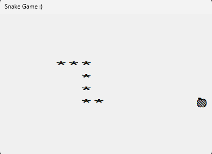

# Snake Game

Welcome to the Snake Game repository! This project features a classic implementation of the Snake game. It’s a fun and interactive game where the player controls a snake that grows longer as it eats food. The goal is to avoid collisions with the walls and the snake’s own tail.



## Table of Contents

- [Installation](#installation)
- [Usage](#usage)
- [Features](#features)

## Installation

To get started with the Snake Game, follow these steps:

1. **Clone the Repository:**
   ```bash
   git clone https://github.com/karim0mar/Snake-Game.git
   ```

2. **Navigate to the Project Directory:**
   ```bash
   cd Snake-Game
   ```

3. **Install Dependencies:**
   This project uses `pygame` for game development. Install it using pip:
   ```bash
   pip install pygame
   ```

## Usage

1. **Run the Game:**
   In the project directory, execute the following command to start the game:
   ```bash
   python snake_game.py
   ```

2. **Controls:**
   - Use the arrow keys (←, →, ↑, ↓) to control the direction of the snake.
   - The goal is to eat the food that appears on the screen, which causes the snake to grow.
   - Avoid colliding with the walls or the snake’s own tail.

## Features:

- Classic Snake game mechanics.
- Simple controls with arrow keys.
- Increasing difficulty as the snake grows.
- Basic collision detection with walls and the snake’s tail.
